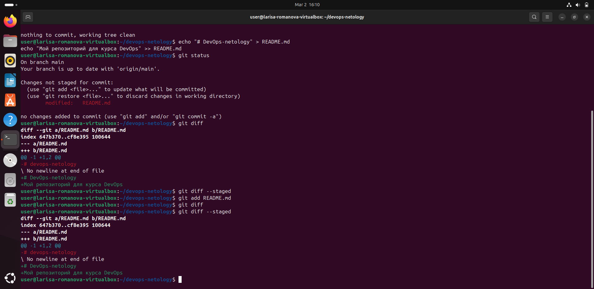
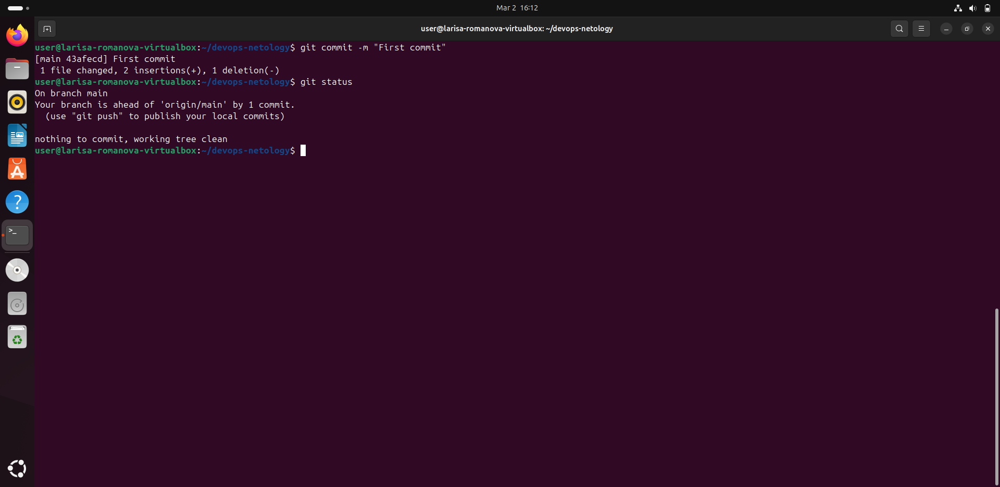
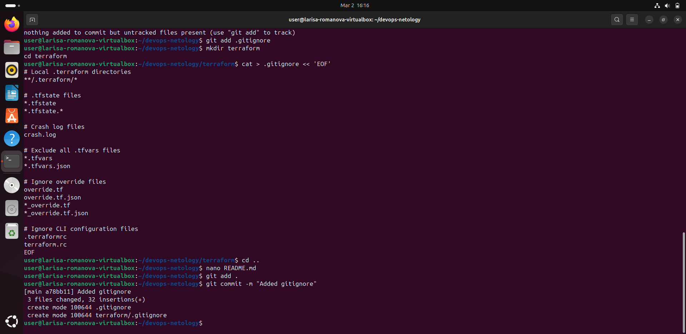
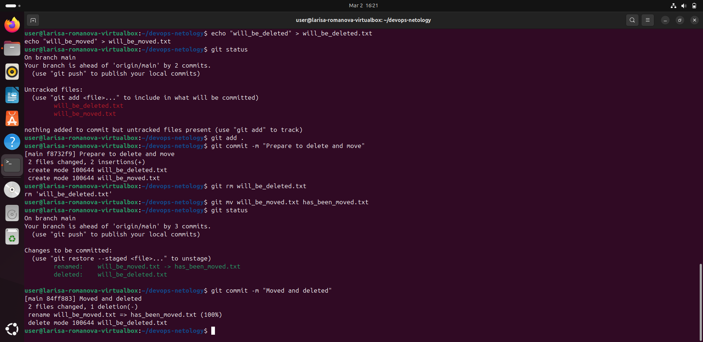
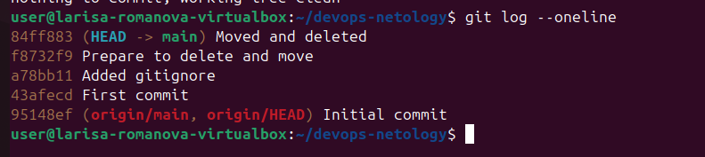

# DevOps-netology
Мой репозиторий для курса DevOps

## .gitignore для Terraform
В папке terraform добавлен .gitignore, который будет игнорировать:
- Папки **/.terraform/ - содержат скачанные модули и провайдеры
- Файлы *.tfstate и *.tfstate.* - содержат состояние инфраструктуры
- Файлы crash.log - логи ошибок
- Файлы *.tfvars и *.tfvars.json - содержат чувствительные переменные
- Файлы override.tf, *_override.tf - файлы переопределения
- Файлы .terraformrc и terraform.rc - конфигурации CLI

## Скриншоты выполнения задания

